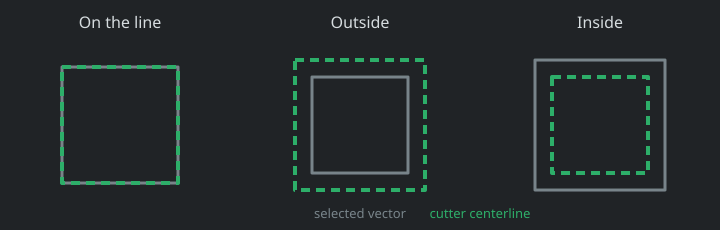

General profile toolpaths
=========================

The General Purpose workbench can generate a profile cut from the exterior of
the selected vector. The current vector generator creates circles; the same
operation boundary is intended for future closed vector objects and imported
SVG silhouettes.

Create a profile
----------------

1. Create or select a vector in the **2D View**.
2. In the **Toolpath Panel**, select the square **Create Profile Toolpath**
   button. The button is disabled until a vector is selected.
3. Choose a valid endmill-style cutter from the General Toolbit Library.
4. Set the cut side and depth controls, then select **Generate**.

The green centerline appears in both the 2D and 3D views. In 3D, each depth
pass is drawn below the material surface. Generating another profile replaces
the current generated profile and its internal G-code buffer; writing that
buffer to a user-selected file is reserved for the export workflow.

Profile controls
----------------

**Cutter**
   Selects a valid Endmill, Ballnose, or Bullnose definition from
   **Settings > Toolbit Library**. The operation freezes the selected toolbit
   values when it is generated. Profile-capable definitions remain visible
   when dimensions, feed, or plunge still need attention; **Generate** stays
   disabled and identifies the first field to correct. Drill, V-bit, chamfer,
   slitting-saw, and probe definitions are not offered because their effective
   profile diameter requires operation-specific handling.

**Cut side**
   **On the line** follows the selected vector without cutter-radius
   compensation. **Outside** moves the cutter center away from the closed
   exterior by the tool radius. **Inside** moves it toward the interior by the
   tool radius.

**Additional offset**
   Adds clearance on the selected side. A positive value moves an Inside or
   Outside cut farther in that chosen direction; a negative value reduces its
   compensation. For **On the line**, positive is outward and negative is
   inward. An offset that would collapse the path is rejected.

**Cut depth**
   The total positive distance cut down from the material surface.

**Pass depth**
   The maximum depth removed by each pass. The final pass is shortened when
   necessary to finish at the exact cut depth.

**Safe height**
   Clearance above the current Z-zero surface used for rapid positioning.

**Feed rate** and **Plunge rate**
   Per-operation cutting and plunging speeds. They start with the selected
   toolbit's general defaults, but edits here apply only to this profile
   operation and do not change the library definition. Switching cutters
   refreshes these two fields from the newly selected toolbit defaults.

The generated buffer is deterministic metric G-code. It contains absolute
positioning, tool selection, spindle direction, safe moves, the configured
per-operation plunge/feed rates, one closed profile move per depth pass, and a
normal spindle stop/program end.

Toolpath list
-------------

Every generated profile cut is retained in the lower half of the Toolpath
Panel. The list identifies the source vector, cut side, and tool number.

Click a row to select its source vector in the 2D view. Use **Show** to enable
or disable that toolpath in the 2D and 3D previews. Double-click a row to reopen
its profile settings and update the existing toolpath. Generating another
profile adds a separate row, including when it uses the same vector.
